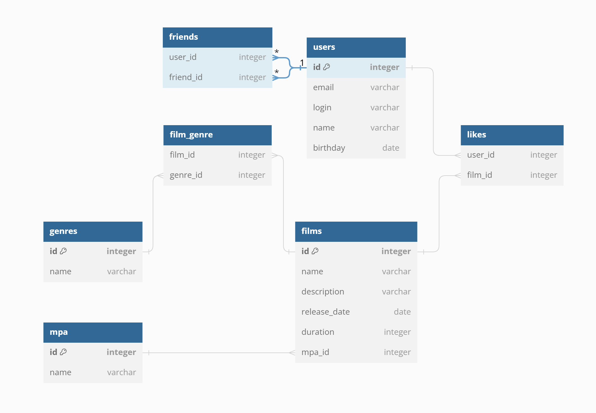

# java-filmorate
Template repository for Filmorate project.

## ERD


## DBML Code for ERD
>Use DBML to define your database structure. https://dbml.dbdiagram.io/docs
```
Table friends {
user_id integer
friend_id integer
}

Table likes {
user_id integer
film_id integer
}

Table film_genre {
film_id integer
genre_id integer
}

Table users {
id integer [primary key]
email varchar
login varchar
name varchar
birthday date
}

Table films {
id integer [primary key]
name varchar
description varchar
release_date date
duration integer
mpa_id integer
}

Table mpa {
id integer [primary key]
name varchar
}

Table genres {
id integer [primary key]
name varchar
}

Ref: mpa.id < films.mpa_id

Ref: friends.user_id > users.id
Ref: friends.friend_id > users.id

Ref: likes.film_id > films.id
Ref: likes.user_id > users.id

Ref: film_genre.film_id > films.id
Ref: film_genre.genre_id > genres.id
```